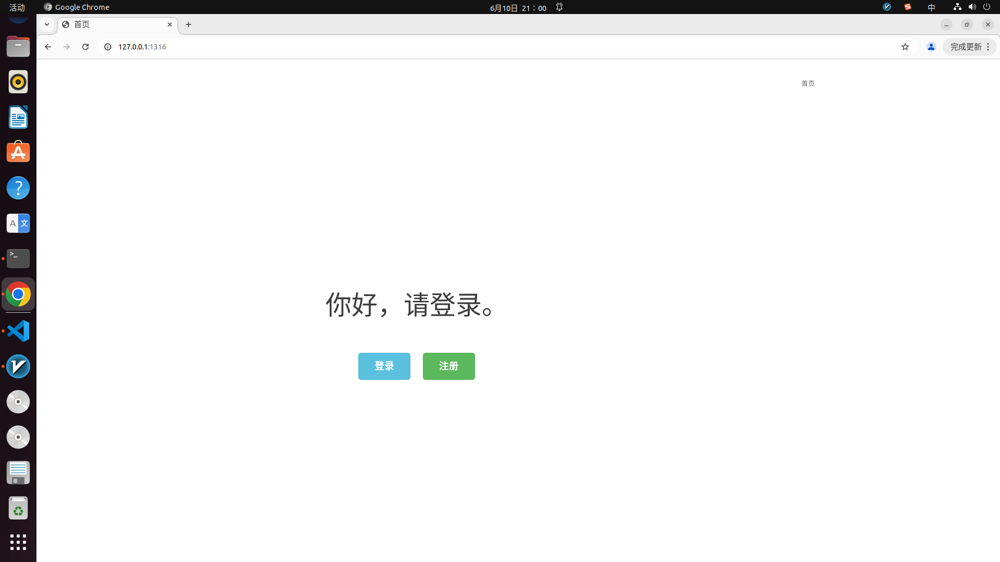
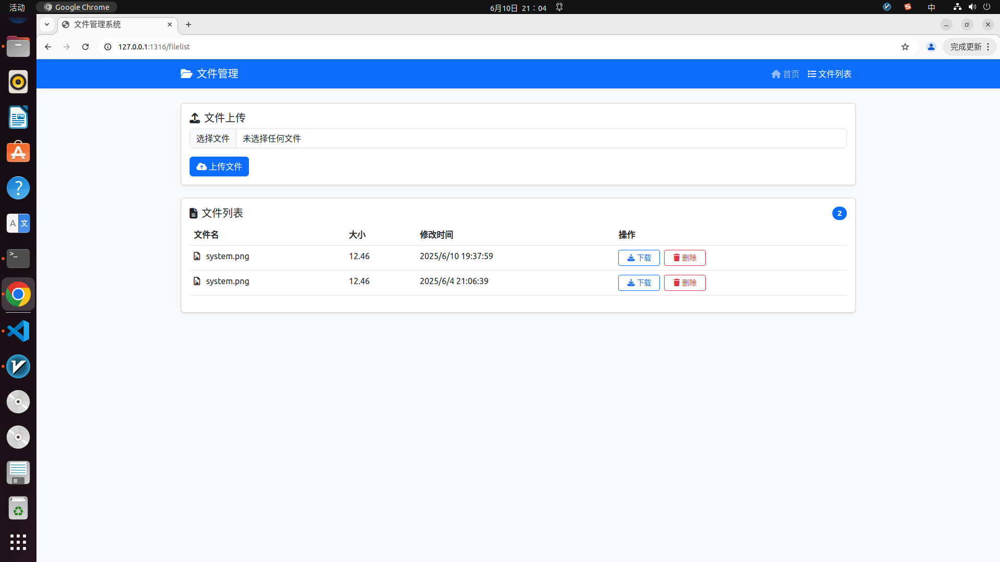

<!--
 * @Author: Wang
 * @Date: 2025-04-16 15:18:20
 * @LastEditors: Please set LastEditors
 * @LastEditTime: 2025-06-10 21:06:59
 * @Description: 请填写简介
-->
# 基于Linux的WebServer项目
使用C++实现了一个简单的webserver服务器，具有请求静态文件（html）和多文本格式上传功能
## 功能
* I/O 多路复用：基于Reactor模式实现高并发，主线程通过Epoll监听连接事件，
子线程处理业务逻辑
* HTTP 协议处理：基于正则表达式与状态机解析HTTP请求报文，支持静态文
件（HTML）响应与多格式文件上传
* 数据库：RAII机制实现了数据库连接池，减少数据库连接建立与关闭的开销，
实现了用户注册登录功能，此外，将上传的文件与数据库相关联，并在页面中能动态刷新上传的文件信息


## 功能显示
### 主页面显示

### 登录界面

### 上传界面


## 环境要求
* Linux
* C++17
* Mysql

## 目录树
```
├── bin
│   ├── log
│   ├── resources
│   ├── server
│   └── upload
├── build
│   └── Makefile
├── code
│   ├── buffer
│   ├── config
│   ├── http
│   ├── log
│   ├── main.cpp
│   ├── pool
│   ├── processing
│   ├── readme.md
│   ├── server
│   └── timer
├── LICENSE
├── Makefile
├── readme.assest
│   └── 压力测试.png
├── README.md
└── webbench-1.5
    ├── Makefile
    ├── socket.c
    ├── tags
    ├── webbench
    ├── webbench.c
    ├── webbench.o
    └── webbench_report.txt

```
## 项目启动
需要先配置好对应的数据库
```bash
// 建立yourdb库
create database yourdb;

// 创建user表
USE yourdb;
CREATE TABLE user (
    id INT AUTO_INCREMENT PRIMARY KEY,
    username CHAR(50) UNIQUE,
    password CHAR(50)
) ENGINE=InnoDB;

// 创建文件上传记录表 uploaded_files
CREATE TABLE uploaded_files (
    id INT AUTO_INCREMENT PRIMARY KEY,
    original_filename VARCHAR(255),
    stored_filename VARCHAR(255),
    file_path VARCHAR(255),
    file_size INT,
    upload_time DATETIME,
    file_type VARCHAR(50),
    uploader_id INT,
    FOREIGN KEY (uploader_id) REFERENCES user(id)
) ENGINE=InnoDB;
// 添加数据
INSERT INTO user(username, password) VALUES('name', 'password');
```

```bash
make
./bin/server
```

## 压力测试
使用webbench或者Apache BenchMark
### 安装和使用Apache BenchMark
```
sudo apt-get install apache2-utils
ab -n 1000 -c 1000 http://ip:port/
```
### 使用Webbench
```
./webbench-1.5/webbench -c 100 -t 10 http://ip:port/
./webbench-1.5/webbench -c 1000 -t 10 http://ip:port/
```
QPS只能达到1000+

## 致谢
https://github.com/markparticle/WebServer.git
在其基础上，进行了修改，如下：
* 将解析HTTP请求的状态机模式从按行分成两部分，读取请求头和请求体，请求头仍保持按行读取不变，请求体则一次读取完毕所有的Content-Length长度，适合多文本格式上传
* 在response中增加了响应json格式，而不是只响应html文件；包括upload和delete，其中upload会处理请求体，响应upload时将请求体作为写入到本地文件夹中，响应delete时，从本地文件夹删除与文件名相同的文件
* 修复了HTTP长连接+缓冲区机制下的读取不完全问题。在文件上传功能时，发现从socket中读取数据经常只能读取header，读不了body。修正httpconn::process()逻辑和WebServer::OnRead_()，判断读取不完整时会继续读取。但是会造成性能下降。
