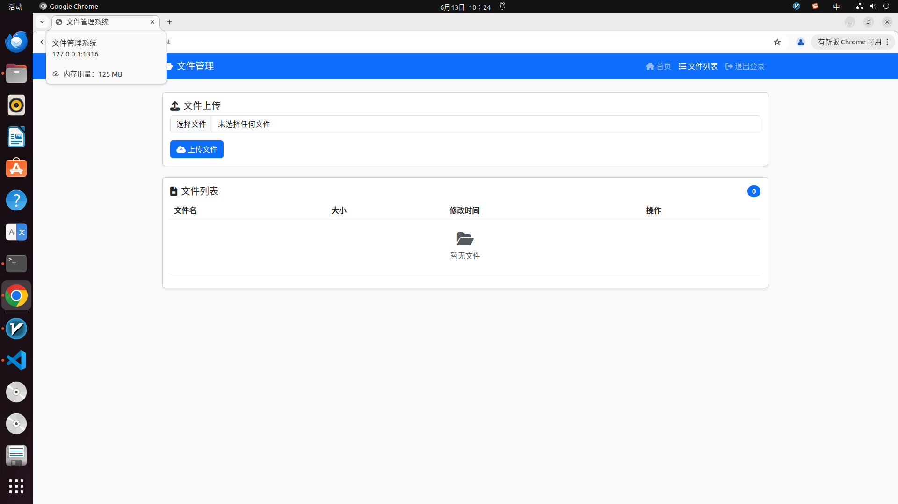

<!--
 * @Author: Wang
 * @Date: 2025-04-16 15:18:20
 * @LastEditors: Please set LastEditors
 * @LastEditTime: 2025-06-13 11:14:46
 * @Description: 请填写简介
-->
# 基于Linux的WebServer项目
使用C++实现了一个简单的webserver服务器，具有请求静态文件（html）和多文本格式上传功能、同时使用了Mysql管理实现用户登录、注册以及文件管理，使用redis实现用户登录状态保存和验证
## 功能
 *  多路复用与高并发处理：基于Reactor模式和epoll实现I/O多路复用，主线程=
监听事件，子线程池处理业务逻辑，实现数千级并发连接处理。
*  完整HTTP协议栈支持：自研状态机与正则解析器，支持HTTP/1.1请求解析、
静态文件响应、多格式multipart/form-data文件上传。
*  会话管理与权限控制：基于Redis实现Session管理机制，支持用户登录
状态保存、自动过期与Cookie验证，确保上传/查询接口的权限隔离。
*  定时器机制优化资源：引入小根堆定时器，实时剔除超时连接，避免空闲连接
占用资源，提高系统吞吐。
*  异步日志系统：使用单例模式+阻塞队列构建异步日志模块，支持INFO/ERROR
等级别分类与文件记录，提升系统可观测性与调试能力。
*  用户认证与数据库封装：通过MySQL实现用户注册/登录模块，使用RAII封
装连接池，提高数据库访问并发效率。

## 功能显示
### 主页面显示,包含登录、注册、上传等按钮

### 登录界面

### 上传界面
* 登录者1上传文件后的页面

* 登陆者2未上传文件的页面


## 环境要求
* Linux
* C++17
* Mysql
* redis++

## 目录树
```
├── bin
│   ├── log
│   ├── resources
│   ├── server
│   └── upload
├── build
│   └── Makefile
├── code
│   ├── buffer
│   ├── config
│   ├── http
│   ├── log
│   ├── main.cpp
│   ├── pool
│   ├── processing
│   ├── readme.md
│   ├── server
│   └── timer
├── LICENSE
├── Makefile
├── readme.assest
│   └── 压力测试.png
├── README.md
└── webbench-1.5
    ├── Makefile
    ├── socket.c
    ├── tags
    ├── webbench
    ├── webbench.c
    ├── webbench.o
    └── webbench_report.txt

```
## 项目启动
需要先配置好对应的数据库
```bash
// 建立yourdb库
create database yourdb;

// 创建user表
USE yourdb;
CREATE TABLE user (
    id INT AUTO_INCREMENT PRIMARY KEY,
    username CHAR(50) UNIQUE,
    password CHAR(50)
) ENGINE=InnoDB;

// 创建文件上传记录表 uploaded_files
CREATE TABLE uploaded_files (
    id INT AUTO_INCREMENT PRIMARY KEY,
    original_filename VARCHAR(255),
    stored_filename VARCHAR(255),
    file_path VARCHAR(255),
    file_size INT,
    upload_time DATETIME,
    file_type VARCHAR(50),
    uploader_id INT,
    FOREIGN KEY (uploader_id) REFERENCES user(id)
) ENGINE=InnoDB;
// 添加数据
INSERT INTO user(username, password) VALUES('name', 'password');
```

```bash
make
./bin/server
```

## 压力测试
使用webbench或者Apache BenchMark
### 安装和使用Apache BenchMark
```
sudo apt-get install apache2-utils
ab -n 1000 -c 1000 http://ip:port/
```
### 使用Webbench
```
./webbench-1.5/webbench -c 100 -t 10 http://ip:port/
./webbench-1.5/webbench -c 1000 -t 10 http://ip:port/
```
QPS只能达到1000+

## 致谢
https://github.com/markparticle/WebServer.git
在其基础上，进行了修改，如下：
* 将解析HTTP请求的状态机模式从按行分成两部分，读取请求头和请求体，请求头仍保持按行读取不变，请求体则一次读取完毕所有的Content-Length长度，适合多文本格式上传
* 在response中增加了响应json格式，而不是只响应html文件；包括upload和delete，其中upload会处理请求体，响应upload时将请求体作为写入到本地文件夹中，响应delete时，从本地文件夹删除与文件名相同的文件
* 修复了HTTP长连接+缓冲区机制下的读取不完全问题。在文件上传功能时，发现从socket中读取数据经常只能读取header，读不了body。修正httpconn::process()逻辑和WebServer::OnRead_()，判断读取不完整时会继续读取。但是会造成性能下降。
* 重点添加了Mysql服务，将上传的文件与Mysql相联系，使用数据库管理和记录上传文件
* 使用了redis进行登录验证，登录信息可先缓存至 Redis，避免频繁访问主数据库，提高整体系统性能。

## TODO：
* redis中只存储了登录状态（Token），没有做加速登录验证，后续可以尝试当系统用户量大时，为了减少频繁数据库查用户名，可以把用户 ID 映射表缓存进 Redis
* redis中也没有进行登录唯一性确认，可以添加
* 整个项目的逻辑大体流畅，但部分细节还可以简化和修改
